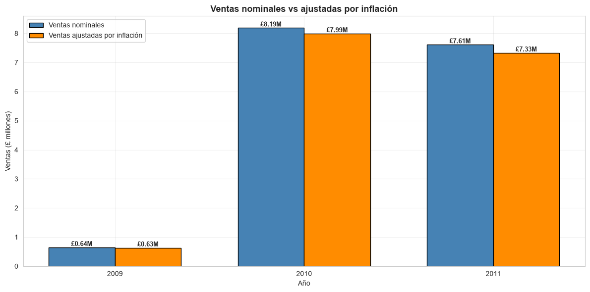
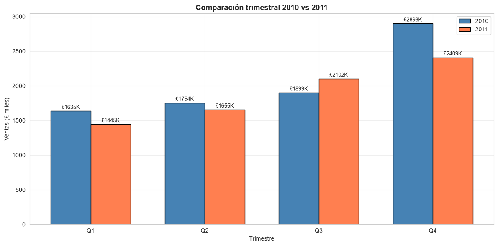
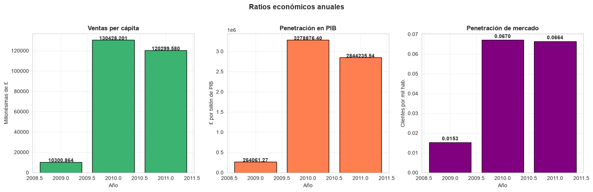
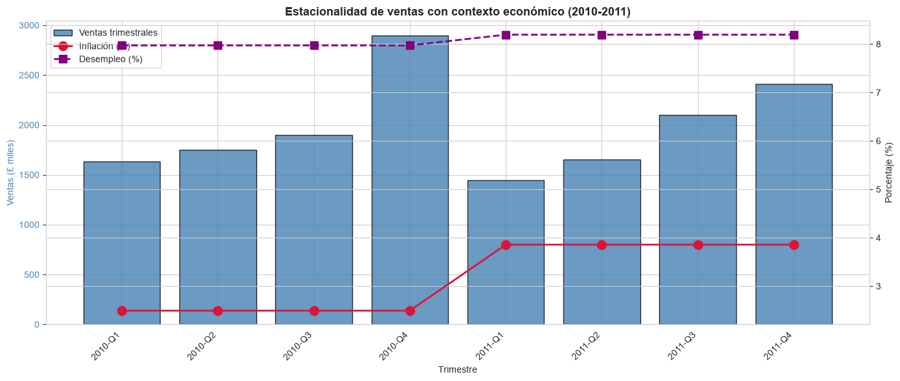

# 🌍 Reto 6 — Dataset enriquecido con Open Data

[](https://www.python.org/)
[](https://pandas.pydata.org/)
[](https://numpy.org/)
[](https://matplotlib.org/)
[](https://seaborn.pydata.org/)
[](https://data.worldbank.org/)
[](https://www.nomisweb.co.uk/)
[](LICENSE)
[]()

Proyecto de **Business Intelligence** que enriquece un dataset comercial de ventas (**Online Retail II**) con **Open Data** del **World Bank** y del **ONS** (Office for National Statistics), realizando un análisis comparativo que revela insights imposibles de obtener con datos internos.

---

## 📌 Descripción

Este proyecto demuestra cómo el **Open Data** puede transformar el análisis de negocio al aportar contexto económico y demográfico externo. Combinando ventas internas con indicadores macroeconómicos del Reino Unido, se descubren insights sobre el impacto de la **inflación**, el **desempleo** y el **crecimiento económico**.

---

## 🎯 Objetivo

Enriquecer un dataset comercial con datos abiertos y realizar un **análisis comparativo** que revele nuevas perspectivas sobre el negocio.

---

## 📊 Datasets utilizados

### Dataset principal

| Atributo | Valor |
|---|---|
| **Fuente** | Online Retail II (UCI Machine Learning Repository) |
| **Transacciones** | 767.853 (tras limpieza) |
| **Periodo** | Diciembre 2009 – Diciembre 2011 |
| **País** | Reino Unido |

### Open Data

| Fuente | Datos |
|---|---|
| **World Bank Open Data** | PIB, inflación, desempleo, población |
| **ONS Nomis** | Población por región UK |

---

## 🔍 Hallazgos principales

| # | Hallazgo | Cifra |
|---|---|---|
| 1 | Impacto de la inflación en las ventas reales | **−£282.555** |
| 2 | Caída del Q4 2011 vs Q4 2010 | **−16,9%** |
| 3 | Divergencia con la economía UK | **+7,2% PIB vs −7% ventas** |

### Interpretación

- **La inflación erosiona el 3,71% de las ventas** en 2011.
- **La campaña navideña (Q4) cayó un 16,9%**, coincidiendo con el pico de inflación (3,86%) y desempleo (8,2%).
- **La tienda no aprovecha el crecimiento económico**: mientras el PIB UK crecía, las ventas caían.

---

## 🛠️ Tecnologías utilizadas

<p align="center">
  
  
  
  
  
</p>

| Herramienta | Uso |
|---|---|
| **Python 3.13** | Lenguaje principal |
| **pandas** | Manipulación de datos |
| **NumPy** | Operaciones numéricas |
| **matplotlib / seaborn** | Visualizaciones |
| **World Bank API** | Open Data económico |
| **ONS Nomis** | Open Data demográfico |

---

## 📁 Estructura del proyecto

```
Reto6_OpenData_Retail/
│
├── datos/
│   ├── principal/                    # Online Retail II (limpio)
│   │   ├── online_retail_completo.csv
│   │   └── online_retail_limpio.csv
│   ├── open_data/
│   │   ├── indicadores_economicos.csv
│   │   ├── poblacion_por_region.csv
│   │   └── raw/                      # Datos originales descargados
│   │       ├── ons_uk_population_by_region.xlsx
│   │       ├── world_bank_uk_gdp.csv
│   │       ├── world_bank_uk_inflation.csv
│   │       ├── world_bank_uk_population.csv
│   │       └── world_bank_uk_unemployment.csv
│   └── enriquecido/
│       └── Dataset_Enriquecido_Reto6_JuditGiravent.csv
│
├── scripts/                          # Scripts Python
│   ├── 02_limpieza_principal.py
│   ├── 03_limpieza_open_data.py
│   ├── 04_integracion.py
│   ├── 05_analisis_comparativo.py
│   ├── 05b_analisis_trimestral.py
│   └── 05c_analisis_comparativo_final.py
│
├── salidas/
│   ├── figuras/                      # 12 visualizaciones PNG
│   └── resultados/                   # 7 CSVs de resultados
│
├── docs/                             # Entregables del reto
│   ├── Informe_Analisis_Reto6_JuditGiravent.md
│   ├── Informe_Analisis_Reto6_JuditGiravent.pdf
│   ├── Informe_Analisis_Reto6_JuditGiravent.docx
│   └── Presentacion_Reto6_JuditGiravent.pptx
│
├── .gitignore
├── LICENSE
└── README.md
```

---

## 🚀 Cómo reproducir el proyecto

### 1. Clonar el repositorio

```bash
git clone https://github.com/jdthgp27/Reto6_OpenData_Retail.git
cd Reto6_OpenData_Retail
```

### 2. Instalar dependencias

```bash
pip install pandas numpy matplotlib seaborn openpyxl
```

### 3. Descargar los datasets

- **Dataset principal**: descargar desde [UCI](https://archive.ics.uci.edu/ml/datasets/Online+Retail+II) y colocar en `datos/principal/`.
- **Open Data**: descargar los indicadores del World Bank y la población de ONS Nomis en `datos/open_data/raw/`.

### 4. Ejecutar los scripts en orden

```bash
cd scripts

python 02_limpieza_principal.py
python 03_limpieza_open_data.py
python 04_integracion.py
python 05_analisis_comparativo.py
python 05b_analisis_trimestral.py
python 05c_analisis_comparativo_final.py
```

Los resultados (figuras y CSVs) se guardan automáticamente en `salidas/`.

---

## 📸 Visualizaciones destacadas

### Ventas nominales vs ajustadas por inflación



### Comparativa trimestral 2010 vs 2011



### Ratios económicos anuales



### Estacionalidad en contexto



---

## 💡 Conclusiones

El **Open Data** ha permitido pasar de un análisis limitado a uno con contexto macroeconómico:

| Sin Open Data | Con Open Data |
|---|---|
| Solo veíamos ventas nominales | Vemos ventas reales ajustadas por inflación |
| No sabíamos por qué caía el Q4 | Coincide con inflación + desempleo altos |
| No podíamos comparar con la economía | Sabemos que vamos contra el PIB |
| Sin ratios de mercado | Ventas per cápita y por PIB |

### Recomendaciones de negocio

1. **Revisar la política de precios** para compensar la inflación.
2. **Reforzar las campañas del Q4** con antelación.
3. **Analizar la competitividad** del negocio.
4. **Monitorizar indicadores macro** para anticipar caídas.

---

## 📄 Documentación

| Documento | Enlace |
|---|---|
| 📘 **Informe de análisis (PDF)** | [Ver informe](docs/Informe_Analisis_Reto6_JuditGiravent.pdf) |
| 📝 **Informe de análisis (DOCX)** | [Ver informe](docs/Informe_Analisis_Reto6_JuditGiravent.docx) |
| 📄 **Informe de análisis (MD)** | [Ver informe](docs/Informe_Analisis_Reto6_JuditGiravent.md) |
| 🎤 **Presentación ejecutiva (PPTX)** | [Ver presentación](docs/Presentacion_Reto6_JuditGiravent.pptx) |

---

## 🔄 Próximas mejoras

- [ ] Integrar más indicadores macroeconómicos (tipo de cambio, IPC por sector)
- [ ] Análisis de cohortes de clientes
- [ ] Predicción de ventas con modelos de series temporales (SARIMA, Prophet)
- [ ] Dashboard interactivo con Power BI
- [ ] Automatizar la actualización de Open Data con APIs

---

## 👤 Autora

**Judit Giravent Pineda**

- GitHub: [@jdthgp27](https://github.com/jdthgp27)
- LinkedIn: [judit-giravent-27b167156](https://www.linkedin.com/in/judit-giravent-27b167156/)
- Email: jdthgp27@gmail.com

---

## 📜 Licencia

Este proyecto está bajo la **Licencia MIT**. Consulta el archivo [LICENSE](LICENSE) para más detalles.

---

## 🙏 Agradecimientos

- [UCI Machine Learning Repository](https://archive.ics.uci.edu/ml/datasets/Online+Retail+II) por el dataset **Online Retail II**.
- [World Bank Open Data](https://data.worldbank.org/) por los indicadores macroeconómicos.
- [ONS Nomis](https://www.nomisweb.co.uk/) por los datos demográficos.

---

⭐ Si este proyecto te ha resultado útil, considera darle una estrella en GitHub.